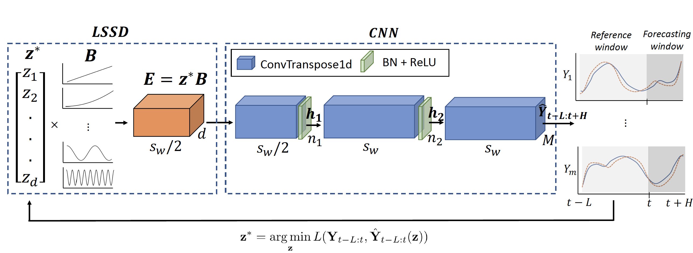

# SpectraNet: multivariate forecasting and imputation under distribution shifts and missing data

## Contents

1. [Overview of Methodology](#methodology) 
2. [Installation](#installation)
3. [Organization](#files)
4. [How to run](#usage)

<!-- <a id="methodology"></a> -->
## Overview

In this work we tackle two widespread challenges in real applications that have been largely understudied: distribution shifts and missing data. We propose SpectraNet, a novel multivariate time-series forecasting model that dynamically infers a latent space spectral decomposition to capture current temporal dynamics and correlations. A Convolution Neural Network maps the learnt representation by sequentially mixing its components and refining the output. Our proposed approach can simultaneously forecast and interpolate past observations. SpectraNet achieves SoTA performance on synthetic data and five benchmark datasets with up to 92% less parameters and comparable training times with baselines. On settings with up to 80% missing data, SpectraNet has average performance improvements of almost 50% over the second best alternative.

<div style="text-align:center">

</div>

<!-- <a id="installation"></a> -->
## Installation

We recommend installing [Ananconda](https://conda.io/projects/conda/en/latest/index.html) to run our code. To install Anaconda, review the installation instructions [here](https://docs.anaconda.com/anaconda/install/). 

To setup the environment using [`conda`](https://conda.io/projects/conda/en/latest/index.html), run the following commands:

```console
    # To create environment from environment.yml file
    foo@bar:~$ conda env create -f environment.yml
    
    # To activate the environment
    foo@bar:~$ conda activate spectranet 
    
    # To verify if the new environment was installed correctly
    foo@bar:~$ conda env list 

```

----

<!-- <a id="files"></a> -->
## Organization

* `run_spectranet.py`: Runs SpectraNet results of the paper on a predefined benchmark dataset, one of [ILI, Exchange, ETTm2, Weather, solar]. The script will select optimal hyperparameters on the validation set, and produce forecasts for the test set.
* `src/models/spectranet.py`: SpectraNet model.
* `src/data/ts_dataset.py`: Custom Time-series Dataset class.
* `src/hyperpar_selection.py`: Contains auxiliary functions and the `hyperpar_selection` method to run the full pipeline.

Datasets should be placed in the `data` folder, following ILI example included in this repo.

----

<!-- <a id="usage"></a> -->
## How to run

Run the following line to produce forecasts for each benchmark dataset. `hyperopt_max_evals` controls the number of steps of the HYPEROPT algorithm for hyperparameter selection, `occlusion_size` controls the size of the segments to occlude. The script will repeat the pipeline for different occlusion probabilities: 0, 20%, 40%, 60%, and 80%.

```console
python run_spectranet.py --dataset 'ILI' --hyperopt_max_evals 15 --occlusion_size 10 --experiment_id "NAME"
```

Results will be stored in the `results` folder.